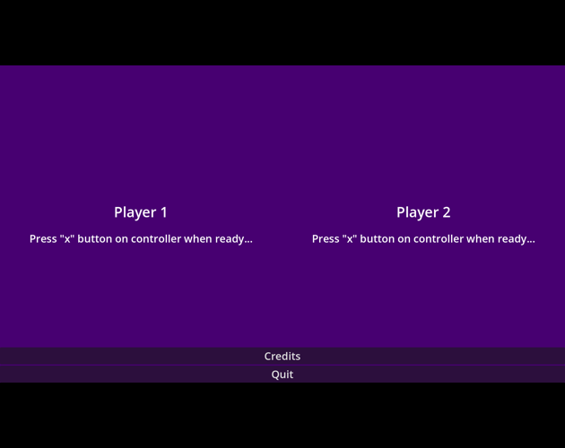
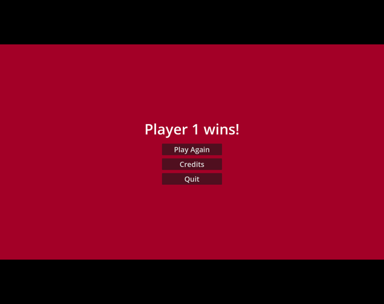

# 🍕🚀 Pizza Battle in Space!
A Spacewar! Clone.

My game #4 of the [20 Games Challenge](https://20_games_challenge.gitlab.io/).

## 🖼️ Screenshots

## 🕹️ Play

https://mjkjr.itch.io/pizza-battle-in-space-spacewar-clone

## 👋 Acknowledgments

- Design: [Michael J. Kozubal Jr.](https://mjkjr.itch.io/)
- Code: [Michael J. Kozubal Jr.](https://github.com/mjkjr)
- Engine: [Godot](https://godotengine.org/)
- Artwork: Aurelia Kozubal
- Sound Effects: Aurelia Kozubal
- Background Music: [JDSherbert](https://jdsherbert.itch.io/)
- Technical Artwork: Michael J. Kozubal Jr.
- Play Testing: Zeph Kozubal
- Play Testing: Aurelia Kozubal
- Special Thanks: [Matthew S](https://20_games_challenge.gitlab.io/)
